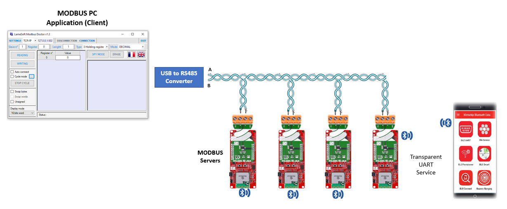
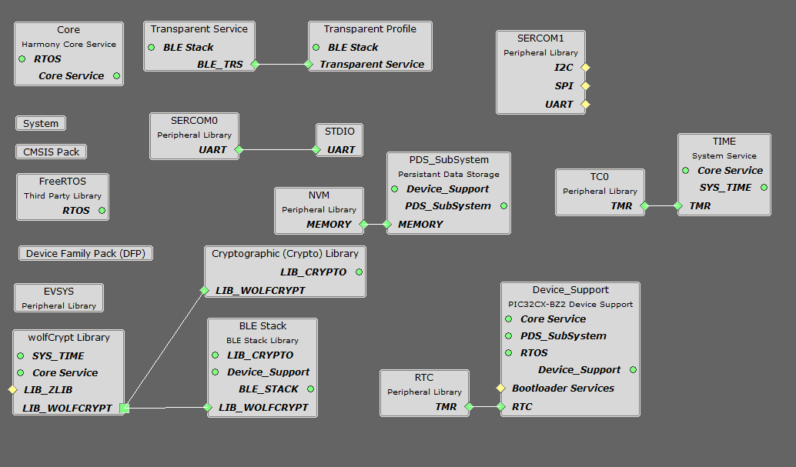
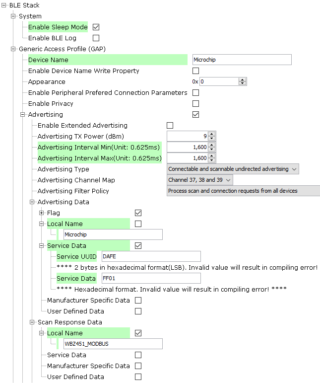
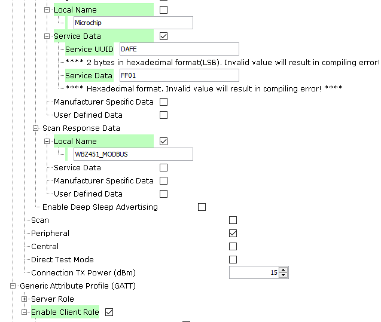
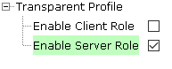
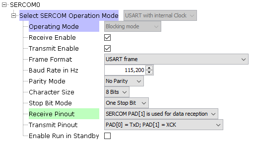
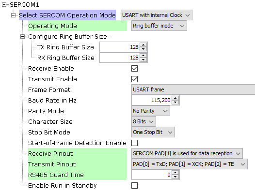
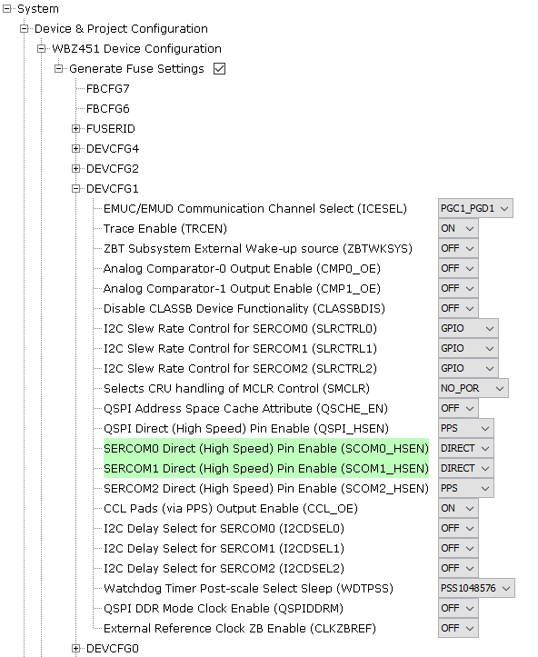
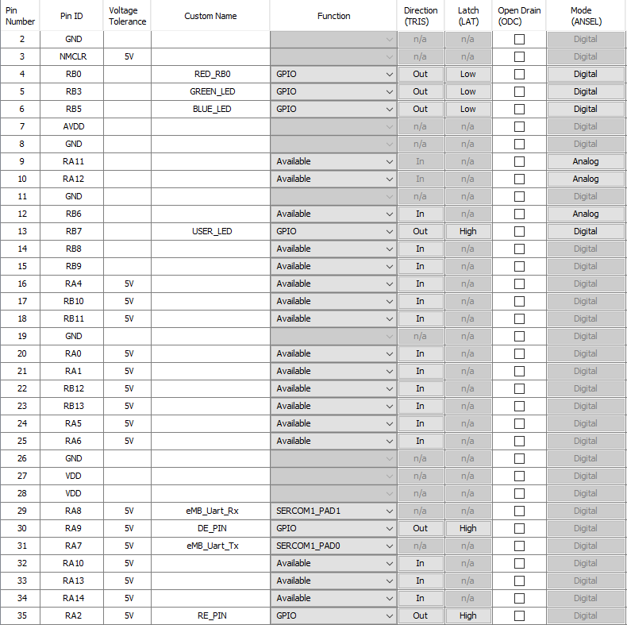

# PIC32CXBZ2_WBZ45x_BLE_UART_MODBUS

> "IOT Made Easy!" 

Devices: **| PIC32CXBZ2 | WBZ45x |** 
Features: **| BLE | MODBUS |**

## ⚠ Disclaimer

<b>
THE SOFTWARE ARE PROVIDED "AS IS" AND GIVE A PATH FOR SELF-SUPPORT AND SELF-MAINTENANCE. This repository contains example code intended to help accelerate client product development.  

For additional Microchip repos, see: <a href="https://github.com/Microchip-MPLAB-Harmony" target="_blank">https://github.com/Microchip-MPLAB-Harmony</a>

Checkout the <a href="https://microchipsupport.force.com/s/" target="_blank">Technical support portal</a> to access our knowledge base, community forums or submit support ticket requests.

</b>

## Contents

1. [Introduction](#step1)
1. [Bill of materials](#step2)
1. [Hardware Setup](#step3)
1. [Software Setup](#step4)
1. [Harmony MCC Configuration](#step5) 
1. [Board Programming](#step6)
1. [Run the demo](#step7)
1. [Related Applications](#step8)

## 1. Introduction<a name="step1">

This example application enables us to develop a request-response protocol using Modbus stack. In this application Modbus Doctor acts as the Client device and WBZ451 Curiosity Board acts as the server devices. The Modbus doctor application in the system is connected to the RS485 2 Click board and WBZ451 interface using a USB to RS485 converter.​ Thw WBZ451 Curiosity boards (server device) also acts as a BLE peripheral device and can be connected to a Mobile phone through MBD mobile application. MBD App [BLE Transparent UART] is used to display the Modbus data/logs to user via BLE.

| Tip | Go through the [overview](https://onlinedocs.microchip.com/pr/GUID-A5330D3A-9F51-4A26-B71D-8503A493DF9C-en-US-2/index.html?GUID-3CC3561E-252E-43B9-BC8A-47DD108A0A46) for understanding the existing BLE application examples |
| :- | :- |

## 2. Bill of materials<a name="step2">

| TOOLS | QUANTITY |
| :- | :- |
| [PIC32CX-BZ2 and WBZ451 Curiosity Development Board](https://www.microchip.com/en-us/development-tool/EV96B94A) | 4 |
| [RS485 2 CLICK](https://www.mikroe.com/rs485-2-click) | 4 |
| [USB tO RS485 Converter] | 1 |

## 3. Hardware Setup<a name="step3">

- Connect the RS485 2 click with the WBZ451 CURIOSITY BOARD using the below table.

|WBZ451|E-PAPER |Description |WBZ451|E-PAPER|Description|
| :- | :- | :- | :- |:- | :- |
|AN|NC|NC|PWM|RE|Receiver Enable|
|RST|NC|NC|INT|NC|NC|
|CS|DE|Driver Enable|RX|TX|USART TX|
|SCK|NC)|NC|TX|RX|USART RX|
|MISO|NC|NC|SCL|NC|NC|
|MOSI|NC|NC|SDA|NC|NC|
|3.3V|7(3.3V)|POWER SUPPLY|5V|NC|NC|
|GND|8(GND)|GROUND|GND|9(GND)|GROUND|

- Connect the USB to RS485 Converter to the system.
- Connect the A and B lines from the USB to RS485 converter to the A and B lines of the RS485 2 click and WBZ451 Curisity board interface. To create a bus connect the RS485 2 click and WBZ451 Curisity board interface to the A and B lines in the same manner. 

| Note: Make sure to have common GND! |
| --- |

## 4. Software Setup<a name="step4">

- [MPLAB X IDE ](https://www.microchip.com/en-us/tools-resources/develop/mplab-x-ide#tabs)

    - Version: 6.05
	- XC32 Compiler v4.10
	- MPLAB® Code Configurator v5.1.17
	- PIC32CX-BZ_DFP v1.0.107
	- MCC Harmony
	  - csp version: v3.14.0
	  - core version: v3.11.1
	  - CMSIS-FreeRTOS: v10.4.6
	  - wireless_pic32cxbz_wbz: v1.1.0
	  - wireless_ble: v1.0.0	  
	  - dev_packs: v3.14.0
	  - wolfssl version: v4.7.0
	  - crypto version: v3.7.6
	    
- Any Serial Terminal application like [TERA TERM](https://download.cnet.com/Tera-Term/3000-2094_4-75766675.html) terminal application

- [MODBUS DOCTOR] (https://www.kscada.com/modbusdoctor.html)

- [MPLAB X IPE v6.05](https://microchipdeveloper.com/ipe:installation)

## 5. Harmony MCC Configuration<a name="step5">

### Getting started with Thermostat application with WBZ451 CURIOSITY BOARD.

| Tip | New users of MPLAB Code Configurator are recommended to go through the [overview](https://onlineDocs.microchip.com/pr/GUID-1F7007B8-9A46-4D03-AEED-650357BA760D-en-US-6/index.html?GUID-AFAB9227-B10C-4FAE-9785-98474664B50A) |
| :- | :- |

**Step 1** - Connect the WBZ451 CURIOSITY BOARD to the device/system using a micro-USB cable.

**Step 2** - The project graph of the application is shown below.

- From Device resources, go to Wireless->Drivers->BLE and select BLE STACK. Accept Dependencies or satisfiers, select "Yes".The configuration is depicted as follows.

- From Device resources, go to Wireless->Drivers->BLE->Profiles and select TRANSPARENT Profile. Accept Dependencies or satisfiers. The configuration is depicted as follows.

- From Device resources, go to Wireless->Drivers->BLE-> Services and select TRANSPARENT Service. Accept Dependencies or satisfiers.

- From Device resources, go to Harmony->Peripherals->SERCOM and selct SERCOM0. Right click on the "⬦" on UART and select STDIO. The configuration is depicted as follows.

- From Device resources, go to Harmony->Peripherals->SERCOM and selct SERCOM1. The configuration is depicted as follows.

- Select Wolfcrypt library and make sure that "Support random number generation" box is unchecked as shown below.

- From Device resources, go to System services and select TIME. Right click on the "⬦" on the instance and select TC0.

- The SYSTEM configuration is depicted as follows.

- From project graph, go to Plugins->PIN configuration and configure as follows.

**Step 4** - [Generate](https://onlineDocs.microchip.com/pr/GUID-A5330D3A-9F51-4A26-B71D-8503A493DF9C-en-US-1/index.html?GUID-9C28F407-4879-4174-9963-2CF34161398E) the code.

**Step 5** - Copy the "modbus" and "port" folder by navigating to the following path: "../firmware/src/" and paste it under source files in your project folder (...\firmware\src).

- In Projects section, right click on Source files to add the ".c" file and Header files to add the ".h" file.
- Select "Add existing items from folder".
- Select Add and browse the location of "app_temphum13" folder (...\firmware\src).
- Make sure the "Files of type" is "C Source files" while adding ".c" files and "Header files" while adding ".h" files.
- Select the folder and click "add".

**Step 6** - In "app_user_edits.c", make sure the below code line is commented 

- "#error User action required - manually edit files as described here".

**Step 7** - Replace the app.c, app.h files and app_ble folder.

| Note | This application repository should be cloned/downloaded to perform the following steps. |
| :- | :- |
| Path | The application folder can be found in the following [link]() |

- Copy the "app.c" and "app.h" files by navigating to the following path: "../firmware/src/"
- Paste the files under source files in your project folder (...\firmware\src).
- Copy the "app_ble" folder by navigating to the following path: (...\firmware\src)
- Paste the files under the respecive folder in your project folder .

**Step 8** - Clean and build the project. To run the project, select "Make and program device" button.

**Step 9** - The data is printed onto the tera term and E-Paper display.

- Baud rate: 115200
- Com port: COM USB serial port
	
### Programming the Server devices

- The Modbus Server application is available in this [link](https://github.com/MicrochipTech/PIC32CXBZ2_WBZ45x_BLE_UART_MODBUS). Follow the steps provided to program more than one server device.
- In "app.c" file, change the SERVER_ADDRESS macro to a unique address before programming each server device as shown below.

## 6. Board Programming<a name="step6">

## Programming hex file:

### Program the precompiled hex file using MPLAB X IPE

- The Precompiled hex file is given in the hex folder.
Follow the steps provided in the link to [program the precompiled hex file](https://microchipdeveloper.com/ipe:programming-device) using MPLABX IPE to program the pre-compiled hex image. 

### Build and program the application using MPLAB X IDE

The application folder can be found by navigating to the following path: 

- ""

Follow the steps provided in the link to [Build and program the application](https://github.com/Microchip-MPLAB-Harmony/wireless_apps_pic32cxbz2_wbz45/tree/master/apps/ble/advanced_applications/ble_sensor#build-and-program-the-application-guid-3d55fb8a-5995-439d-bcd6-deae7e8e78ad-section).

## 7. Run the demo<a name="step7">

- After programming the board, the expected application behavior is shown in the below [video](). In this application the Modbus doctor application acts as the client device and initiates a request to write/read the registers in the server device.

- The Combined Interface application can also be used instead of Alexa to create the ZigBee network.

## 8. Related applications<a name="step8">

- [BLE Applications](https://github.com/Microchip-MPLAB-Harmony/wireless_apps_pic32cxbz2_wbz45/tree/master/apps/ble)
- [WBZ45x BLE UART WITH E-PAPER DISPLAY](https://github.com/MicrochipTech/PIC32CXBZ2_WBZ45x_BLE_UART_E_PAPER_Display/blob/main/WBZ451_E_PAPER_BLE_UART)
- [WBZ45x BLE Sensor Multi-Link Multi-Role Demo](https://github.com/MicrochipTech/PIC32CXBZ2_WBZ45x_BLE_SENSOR_Multi-Role)
