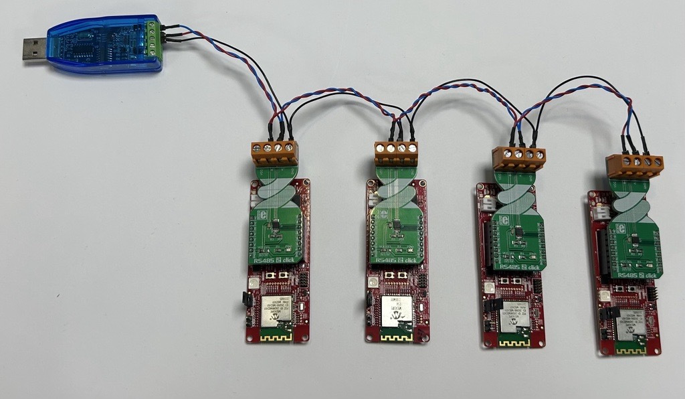
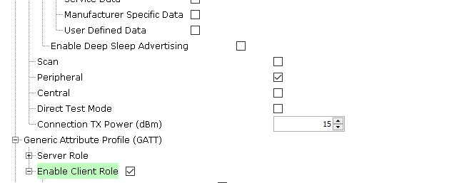
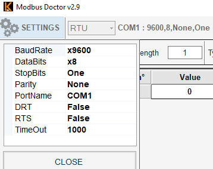
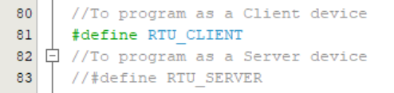
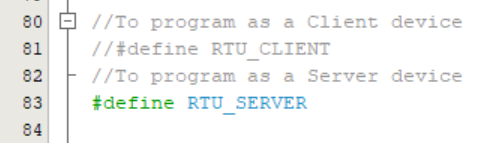
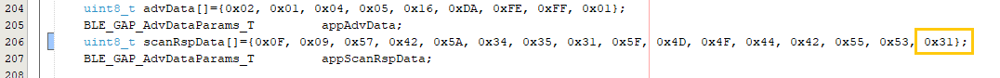

# PIC32CXBZ2_WBZ45x_BLE_UART_MODBUS

> "IOT Made Easy!" 

Devices: **| PIC32CXBZ2 | WBZ45x |** 
Features: **| BLE | MODBUS |**

## ⚠ Disclaimer

<b>
THE SOFTWARE ARE PROVIDED "AS IS" AND GIVE A PATH FOR SELF-SUPPORT AND SELF-MAINTENANCE. This repository contains example code intended to help accelerate client product development.  

For additional Microchip repos, see: <a href="https://github.com/Microchip-MPLAB-Harmony" target="_blank">https://github.com/Microchip-MPLAB-Harmony</a>

Checkout the <a href="https://microchipsupport.force.com/s/" target="_blank">Technical support portal</a> to access our knowledge base, community forums or submit support ticket requests.

</b>

## Contents

1. [Introduction](#step1)
1. [Bill of materials](#step2)
1. [Hardware Setup](#step3)
1. [Software Setup](#step4)
1. [Harmony MCC Configuration](#step5) 
1. [Board Programming](#step6)
1. [Run the demo](#step7)
1. [Related Applications](#step8)

## 1. Introduction<a name="step1">

This example application helps us to develop a request-response protocol using Modbus protocol. The  WBZ451 Curiosity board acts as a client device or server device along with the RS485 2 click board. The RS485 communication with MODBUS protocol is mostly used over industrial sector for its highlighting features like balanced line communication, multi-drop facility, good noise immunity, and maximum data transmission speed. The MODBUS protocol with RS485 physical line makes transactions with multi-server easy and error free.

### WBZ451 curiosity board as Client Device

The  WBZ451 Curiosity board acts as client device or server device. The WBZ451 client device is connected to the WBZ451 server devices through RS485 2 Click board as shown below.​ The WBZ451 Client and server devices act as a Bluetooth(BLE) peripheral device, which helps to connect to the mobile phone through Microchip Bluetooth Data (MBD) mobile application.  On the Client side, the MBD application (BLE Transparent UART) is used to send Modbus commands respective to the WBZ451 Server devices. On the Server side, it is used to display the Modbus data/logs to user via BLE.

### MODBUS Doctor as Client Device

The Modbus Doctor acts as the client device and the WBZ451 Curiosity board acts as the server device. The client device (Modbus Doctor application) is connected to the WBZ451 interface via the RS485 2 Click board using an USB to RS485 converter.​ The WBZ451 Curiosity board also acts as a Bluetooth(BLE) peripheral device, which helps to connect to the mobile phone through Microchip Bluetooth Data (MBD) mobile application. MBD application (BLE Transparent UART) is used to display the Modbus data/logs to user via BLE. 

| Tip | For more details about the existing BLE applications, refer to the overview section of the [PIC32CXBZ2 Application Developer's Guide](https://onlinedocs.microchip.com/pr/GUID-A5330D3A-9F51-4A26-B71D-8503A493DF9C-en-US-2/index.html?GUID-3CC3561E-252E-43B9-BC8A-47DD108A0A46)|
| :- | :- |

## 2. Bill of Materials<a name="step2">

| Tools | Quantity |
| :- | :- |
| [PIC32CX-BZ2 and WBZ451 Curiosity Development Board](https://www.microchip.com/en-us/development-tool/EV96B94A) | 4 |
| [RS485 2 CLICK](https://www.mikroe.com/rs485-2-click) | 4 |
| [USB to RS485 Converter](https://www.google.com/search?q=SpiffySky+USB+to+RS-485+Converter+Adapter+with+CH+340%2F341+Chipset+Supports+All+Windows+Version&rlz=1C1GCEA_enIN1017IN1017&oq=SpiffySky+USB+to+RS-485+Converter+Adapter+with+CH+340%2F341+Chipset+Supports+All+Windows+Version&aqs=chrome..69i57j69i60.232j0j1&sourceid=chrome&ie=UTF-8) | 1 |

## 3. Hardware Setup<a name="step3">

- Connect the RS485 2 click board with the WBZ451 Curiosity board using the connections described in the following table.  

|WBZ451|E-PAPER |Description |WBZ451|E-PAPER|Description|
| :- | :- | :- | :- |:- | :- |
|AN|NC|NC|PWM|RE|Receiver Enable|
|RST|NC|NC|INT|NC|NC|
|CS|DE|Driver Enable|RX|TX|USART TX|
|SCK|NC)|NC|TX|RX|USART RX|
|MISO|NC|NC|SCL|NC|NC|
|MOSI|NC|NC|SDA|NC|NC|
|3.3V|7(3.3V)|POWER SUPPLY|5V|NC|NC|
|GND|8(GND)|GROUND|GND|9(GND)|GROUND|

#### To connect to the Modbus Doctor application

- Connect USB to RS485 converter to the system's USB port.
- Connect the A and B lines of the USB to RS485 converter to the corresponding A and B lines of the RS485 2 click which is interfaced with the WBZ451 Curiosity board. To implement a bus connection, connect the A and B lines of the USB to RS485 converter across all server devices as shown in the image below. 

#### To connect to the WBZ451 Client device

- Connect the A and B lines of the RS485 2 click of the client device to the corresponding A and B lines of the server devices as shown below.

| Note: Make sure to have common GND! |
| --- |

## 4. Software Setup<a name="step4">

- [MPLAB X IDE ](https://www.microchip.com/en-us/tools-resources/develop/mplab-x-ide#tabs)

    - Version: 6.05
	- XC32 Compiler v4.10
	- MPLAB® Code Configurator v5.1.17
	- PIC32CX-BZ_DFP v1.0.107
	- MCC Harmony
	  - csp version: v3.14.0
	  - core version: v3.11.1
	  - CMSIS-FreeRTOS: v10.4.6
	  - wireless_pic32cxbz_wbz: v1.1.0
	  - wireless_ble: v1.0.0	  
	  - dev_packs: v3.14.0
	  - wolfssl version: v4.7.0
	  - crypto version: v3.7.6
	    
- Any Serial Terminal application like [TERA TERM](https://download.cnet.com/Tera-Term/3000-2094_4-75766675.html) terminal application

- [MODBUS DOCTOR](https://www.kscada.com/modbusdoctor.html)

- [MPLAB X IPE v6.05](https://microchipdeveloper.com/ipe:installation)

## 5. Harmony MCC Configuration<a name="step5">

### Getting Started with Modbus Server application with the WBZ451 Curiosity Board

| Tip | New users of MPLAB Code Configurator are recommended to go through the [overview](https://onlineDocs.microchip.com/pr/GUID-1F7007B8-9A46-4D03-AEED-650357BA760D-en-US-6/index.html?GUID-AFAB9227-B10C-4FAE-9785-98474664B50A) |
| :- | :- |

**Step 1** - Connect the WBZ451 Curiosity board to the device/system using a micro-USB cable.

**Step 2** - The project graph of the application is shown below.

- From Device resources, go to Library->Harmony->Wireless->Drivers->BLE and select BLE Stack. Accept Dependencies or satisfiers, select "Yes" for automatic connections. Follow the configurations illustrated in the following figure. .

- From Device resources, go to  Library->Harmony->Wireless->Drivers->BLE->Profiles and select TRANSPARENT Profile. Accept Dependencies or satisfiers. The configuration is depicted as follows.

- From Device resources, go to  Library->Harmony->Wireless->Drivers->BLE-> Services and select TRANSPARENT Service. Accept Dependencies or satisfiers.

- From Device resources, go to  Library->Harmony->Peripherals->SERCOM and selct SERCOM0. Right click on the "⬦" on UART and select STDIO. The configuration is depicted as follows.

- From Device resources, go to  Library->Harmony->Peripherals->SERCOM and selct SERCOM1. The configuration is depicted as follows.

- Select Wolfcrypt library and make sure that "Support random number generation" box is unchecked as shown below.

- From Device resources, go to System services and select TIME. Right click on the "⬦" on the instance and select TC0.

- The SYSTEM configuration is depicted as follows.

- From project graph, go to Plugins->PIN configuration and configure as follows.

**Step 4** - [Generate](https://onlinedocs.microchip.com/pr/GUID-1F7007B8-9A46-4D03-AEED-650357BA760D-en-US-6/index.html?GUID-2EE03524-41FE-4EBA-8646-6D10AA72F365) the code.

**Step 5** - From the downloaded .zip file copy the "modbus" and "port" folder by navigating to the following path: "../firmware/src/" and paste it under source files in your project folder (...\firmware\src).

| Note | This application repository should be cloned/downloaded to perform the following steps. |
| :- | :- |
| Path | The application folder can be found in the following [link](https://github.com/MicrochipTech/PIC32CXBZ2_WBZ45x_BLE_UART_MODBUS) |

#### To add the folder to your MPLAB project
- In Projects section, right click on Source files to add the ".c" file and right click on Header files to add the ".h" file.
- Select "Add existing items from folder".
- Select Add and browse the location of the folder (...\firmware\src).
- Make sure the "Files of type" is "C Source files" while adding ".c" files and "Header files" while adding ".h" files.
- Select the folder and click "add".

**Step 6** - In "app_user_edits.c", make sure the below code line is commented 

- "#error User action required - manually edit files as described here".

**Step 7** - Replace the app.c, app.h files and app_ble folder.

- Copy the "app.c" and "app.h" files by navigating to the following path: "../firmware/src/"
- Paste the files under source files in your project folder (...\firmware\src).
- Copy the "app_ble" folder by navigating to the following path: (...\firmware\src)
- Paste the files under the respecive folder in your project folder .

**Step 8** - Clean and build the project. To run the project, select "Make and program device" button.

### MODBUS Doctor as Client Device

**Step 9** - The Modbus Doctor settings are shown below.

- Mode: RTU
- Baud rate: 9600
- Parity: None
- Data bits: 8
- Stop bits: 1
- Com port: COM USB serial port(CH340)
- Once the settings are done, give "Connection". Once the connection is established, "Status: Connected" message will be shown.

| Note | To connect the system to the USB to RS485 converter, install CH340 driver|
| :- | :- |

**Step 10** - The Modbus doctor initiates a request to write/read the server device's holding register and read the server device's input register.

- Holding register start address: 1 (Maximum Length:32)
- Input register start address: 1000(Maximum Length:64)
- The Server address, Register address, Length and Type of register should be updated in the below section in Modbus doctor application.

### WBZ451 Curiosity board as Client Device

- In "app.h" file, uncomment the RTU_CLIENT macro and comment RTU_SERVER macro before programming to program a client device as shown below.

- Connect the WBZ451 Client device to a mobile phone using MBD app.
- After connecting, send the corresponding modbus data  in the frame format given below to the WBZ451 Client device from MBD app.

|Server Address|Function Code|Register Address|Data|
| :- | :- | :- | :- |

- The scope of this application covers the below mentioned function codes.

|Type|Mode|Function Code|
| :- | :- | :- |
|Coil|Read|0x01|		 	 
|Coil|Write	Single Coil|0x05|		 	 	 
|Coil|Write	Multiple Coil|0x0F|	 	 
|Holding register|Read|0x03|	 	 	 	 
|Holding register|Write	Single register|0x06|	 	 	 
|Holding register|Write Multiple register|0x10|
|Input register|Read|0x04|	

- The Client device calculates the CRC and initiates a request to write/read the server device's coil, holding register and read the server device's input register. 

### Programming Server devices

- In "app.h" file, uncomment the RTU_SERVER macro value and comment the RTU_CLIENT macro before programming, to program a server device as shown below.

- In "app.c" file, change the SERVER_ADDRESS macro to a unique address before programming each server device as shown below.

- In "app_ble.c", change the last hex value of the "scanRspData[]" array to have a unique BLE scan response data.

## 6. Board Programming<a name="step6">

## Programming hex file:

### Program the precompiled hex file using MPLAB X IPE

- The Precompiled hex file is given in the hex folder.
Follow the steps provided in the link to [program the precompiled hex file](https://microchipdeveloper.com/ipe:programming-device) using MPLABX IPE to program the pre-compiled hex image. 

### Build and program the application using MPLAB X IDE

The application folder can be found by navigating to the following path: 

- ".../PIC32CXBZ2_WBZ45x_BLE_UART_MODBUS/firmware/"

Follow the steps provided in the link to [Build and program the application](https://github.com/Microchip-MPLAB-Harmony/wireless_apps_pic32cxbz2_wbz45/tree/master/apps/ble/advanced_applications/ble_sensor#build-and-program-the-application-guid-3d55fb8a-5995-439d-bcd6-deae7e8e78ad-section).

## 7. Run the demo<a name="step7">

### Modbus Doctor as Client device

- After programming the board, the expected application behavior is shown in the below video. 

- In this application the Modbus doctor acts as the client device and initiates a request to write/read the registers in the server device. When a holding register is written in the server device and value is greater than zero it is indicated by the LED in the WBZ451 server device. 
- The server device(BLE Peripheral) is connected to the MBD app(BLE Central) through BLE and the User LED indicates the BLE connection.
- Whenever the client initiates a request to the server device, the information in the data frame is sent to the MBD app(BLE Central device) from the server devices as shown in the above video.
- As shown in the video, by changing the server address the client can write/read the server device.

### WBZ451 curiosity board as Client device

- After programming the board, the expected application behavior is shown in the below video. 

- In this application the Modbus frame is sent to the Client device from the MBD app through BLE UART and the Client device adds the CRC and intiates a request to the server devices. 
- The server devices sends the response for the request to the client device.

## 8. Related applications<a name="step8">

- [BLE Applications](https://github.com/Microchip-MPLAB-Harmony/wireless_apps_pic32cxbz2_wbz45/tree/master/apps/ble)
- [WBZ45x BLE UART WITH E-PAPER DISPLAY](https://github.com/MicrochipTech/PIC32CXBZ2_WBZ45x_BLE_UART_E_PAPER_Display/blob/main/WBZ451_E_PAPER_BLE_UART)
- [WBZ45x BLE Sensor Multi-Link Multi-Role Demo](https://github.com/MicrochipTech/PIC32CXBZ2_WBZ45x_BLE_SENSOR_Multi-Role)
